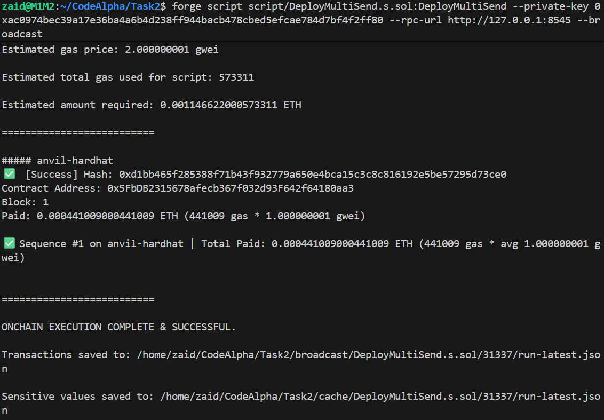
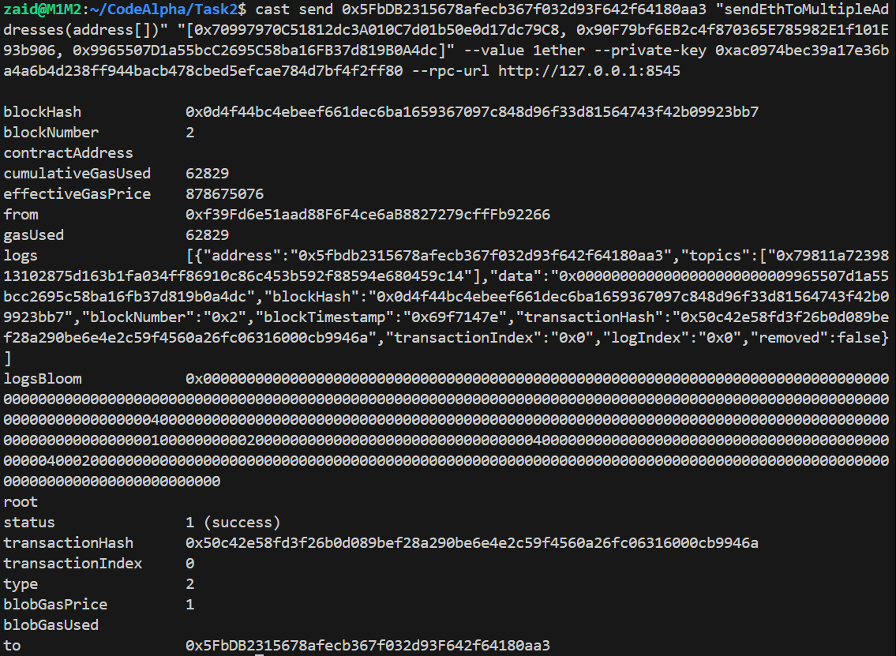

### Deployed the Smart Contract on Local Blockchain (Anvil)
## Use the following command to deploy this contract on anvil.
```solidity
forge script script/DeployMultiSend.s.sol:DeployMultiSend --private-key 0xac0974bec39a17e36ba4a6b4d238ff944bacb478cbed5efcae784d7bf4f2ff80 --rpc-url http://127.0.0.1:8545 --broadcast
```



## Successfully sent the Ether to multiple addresses at once, the total Ether got divided equally and automatically to the number of addresses 
## Use the following command to call the function, you can change the addresses and the private-key as per demand
```solidity
cast send 0x5FbDB2315678afecb367f032d93F642f64180aa3 "sendEthToMultipleAddresses(address[])" "[0x70997970C51812dc3A010C7d01b50e0d17dc79C8, 0x90F79bf6EB2c4f870365E785982E1f101E93b906, 0x9965507D1a55bcC2695C58ba16FB37d819B0A4dc]" --value 1ether --private-key 0xac0974bec39a17e36ba4a6b4d238ff944bacb478cbed5efcae784d7bf4f2ff80 --rpc-url http://127.0.0.1:8545```


